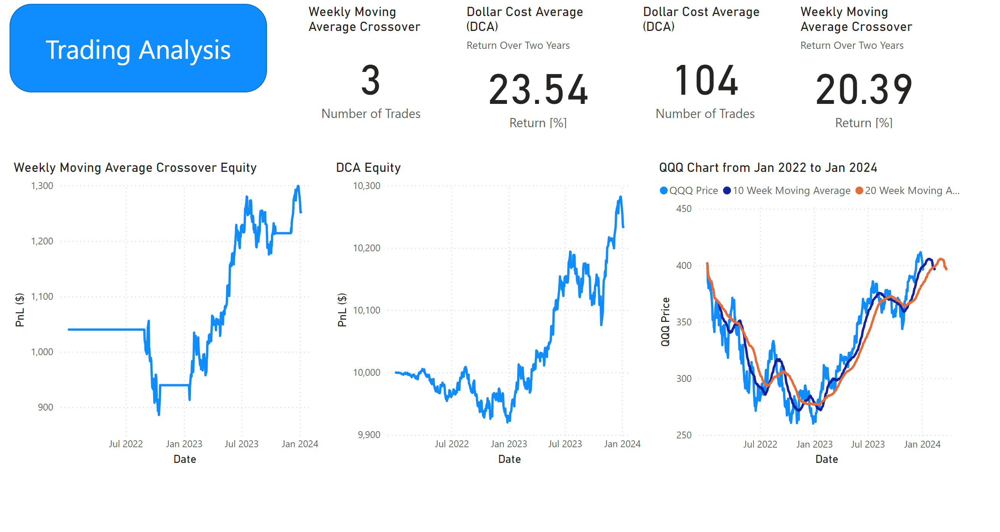

# James' Portfolio

# [Project 1: Trading Analysis - Dollar Cost Average (DCA) VS Moving Average Crossover](https://github.com/jd16641/PortfolioProjects/blob/main/Dollar%20Cost%20Average%20Vs%20Moving%20Average%20Returns%20from%202022%20to%20Present%202.0.ipynb)

This project was written in Pyton using Backtesting.py framework and the TA-Lib technical analysis library. 

It shows a comparison between [Dollar Cost Averaing](https://www.investopedia.com/terms/d/dollarcostaveraging.asp) and a [Moving Average Crossover](https://www.investopedia.com/articles/active-trading/052014/how-use-moving-average-buy-stocks.asp) investing strategies.

- Data was taken from yahoo finance library to generate QQQ data from the start of the 2022 stock market crash to early 2024
- Project utilises object oriented programming within Python, further data analysed in PowerBI

## Overview of the PowerBI Dashboard  

## Insights from the data

### Positive from DCA
- 23.54% return over two years
- Low commitment, you can automate your trades to buy every week

### Negatives from DCA
- Mentally challenging holding through a draw down
- You can only DCA into a reliable index, if you were to average down into a random stock you might never recover

### Positives from Moving Average Crossover
